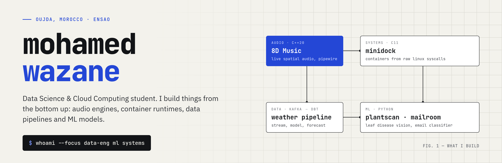
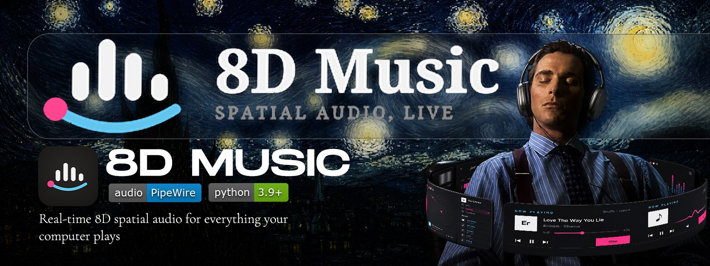
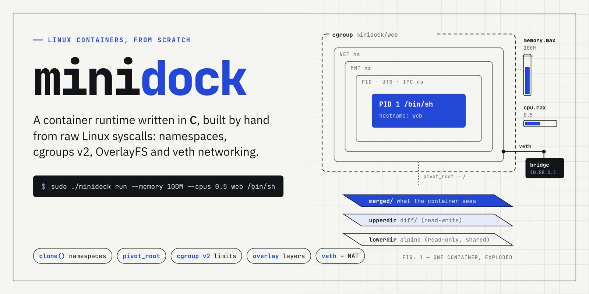
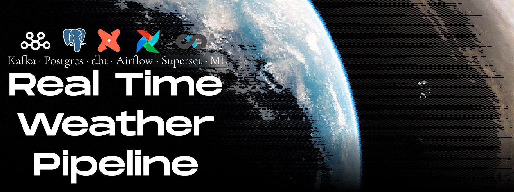
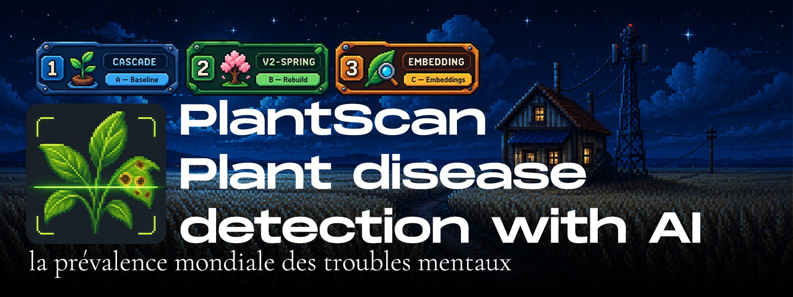
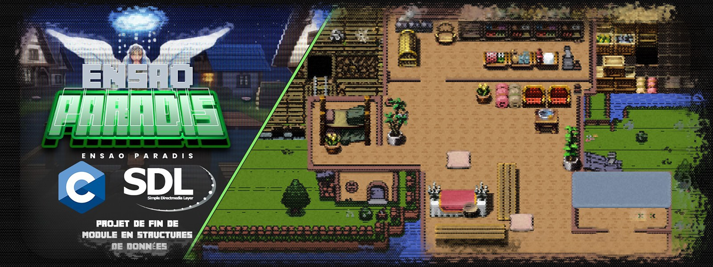
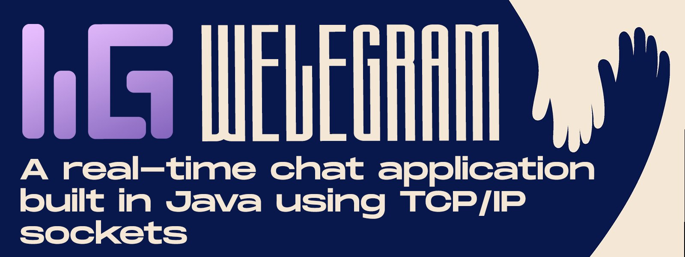
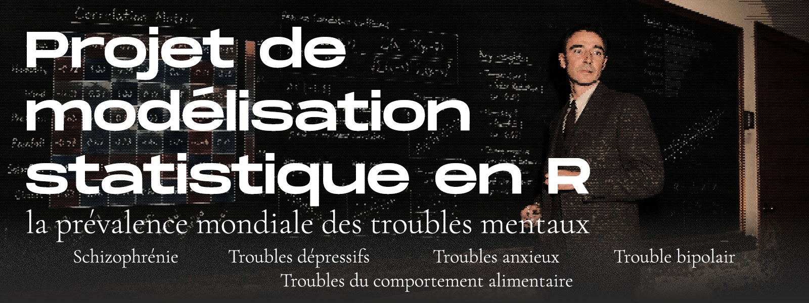
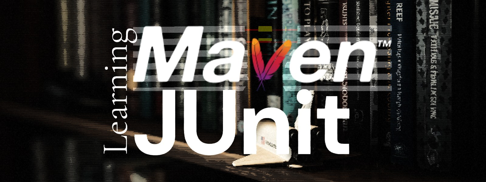

  

  
  
  

## Hi, I'm Mohamed

I study Data Science and Cloud Computing at ENSAO. I learn best by building the real thing from scratch, so most of my repos are small systems made by hand: an audio engine, a container runtime, a streaming data platform, ML models end to end.

- Right now: **8D Music**, live spatial audio for everything your computer plays
- Also into: semantic web, knowledge graphs (RDF, SPARQL, OWL)
- Design lead at DSCC, ADE and Enactus ENSAO

## Featured

**[8D Music](https://github.com/MOHAMEDELWAZANI/8DMusic)** — real-time 8D spatial audio for everything your device plays. YouTube, Spotify, games, Discord: all spatialised live on their way to your headphones. No uploading, no converting. `C++20` `PipeWire` `Android`

## Projects

<table>
<tr>
<td width="50%" valign="top">
 
<b><a href="https://github.com/MOHAMEDELWAZANI/minidock">minidock</a></b> 
A container runtime in C, from raw Linux syscalls: namespaces, cgroups v2, OverlayFS. 
<code>C11</code> <code>Linux</code>
</td>
<td width="50%" valign="top">
 
<b><a href="https://github.com/MOHAMEDELWAZANI/Real-Time-Weather-Pipeline">Real-Time Weather Pipeline</a></b> 
Live weather → Kafka → Postgres → dbt → Superset, orchestrated by Airflow, with a 24h forecast. 
<code>Kafka</code> <code>dbt</code> <code>Airflow</code>
</td>
</tr>
<tr>
<td width="50%" valign="top">
 
<b><a href="https://github.com/MOHAMEDELWAZANI/plantscan">PlantScan</a></b> 
Finds the plant and its disease from one leaf photo. Three ML cores, one benchmark. 
<code>TensorFlow</code> <code>DINOv2</code> <code>Spring Boot</code> <code>React</code>
</td>
<td width="50%" valign="top">
 
<b><a href="https://qcmcloud-kkmo.vercel.app">QCM Cloud</a></b> · <a href="https://github.com/MOHAMEDELWAZANI/qcmcloud">code</a> 
A quiz trainer for Cloud Computing exams: random series, auto-correction, progress. 
<code>Next.js 15</code> <code>Prisma</code> <code>Postgres</code>
</td>
</tr>
<tr>
<td width="50%" valign="top">
 
<b><a href="https://github.com/MOHAMEDELWAZANI/EnsaoParadis">ENSAO Paradis</a></b> · <a href="https://github.com/MOHAMEDELWAZANI/EnsaoParadis-web">web build</a> 
A 2D pixel-art game in C with SDL: rendering, collisions, levels. 
<code>C</code> <code>SDL</code>
</td>
<td width="50%" valign="top">
 
<b><a href="https://github.com/MOHAMEDELWAZANI/Welegrame-JavaSocket">Welegram</a></b> 
A real-time chat app in Java over TCP/IP sockets, with a JavaFX client. 
<code>Java</code> <code>JavaFX</code> <code>Sockets</code>
</td>
</tr>
<tr>
<td width="50%" valign="top">
 
<b><a href="https://github.com/MOHAMEDELWAZANI/Projet-de-mod-lisation-statistique-en-R-">Statistical modelling in R</a></b> 
Global prevalence of mental disorders: schizophrenia, depression, anxiety, bipolar, eating disorders. 
<code>R</code>
</td>
<td width="50%" valign="top">
 
<b><a href="https://github.com/MOHAMEDELWAZANI/LearningMaven">Learning Maven &amp; JUnit</a></b> 
A small bookshop project to learn Maven builds and unit testing properly. 
<code>Java</code> <code>Maven</code> <code>JUnit</code>
</td>
</tr>
</table>

Also: <a href="https://github.com/MOHAMEDELWAZANI/kungFuCoding">kungFuCoding</a> ·
<a href="https://github.com/MOHAMEDELWAZANI/time-series-project">time-series-project</a> ·
<a href="https://github.com/MOHAMEDELWAZANI/forage-midas">forage-midas</a> (JPMorgan Chase sim) ·
CodeCrafters: <a href="https://github.com/MOHAMEDELWAZANI/codecrafters-shell-java">shell</a>,
<a href="https://github.com/MOHAMEDELWAZANI/codecrafters-kafka-java">kafka</a>,
<a href="https://github.com/MOHAMEDELWAZANI/codecrafters-claude-code-python">claude-code</a>

## Tools I use

<code>built from scratch, on purpose.</code>

